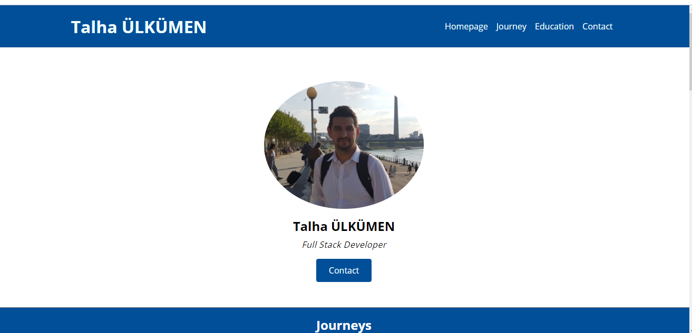
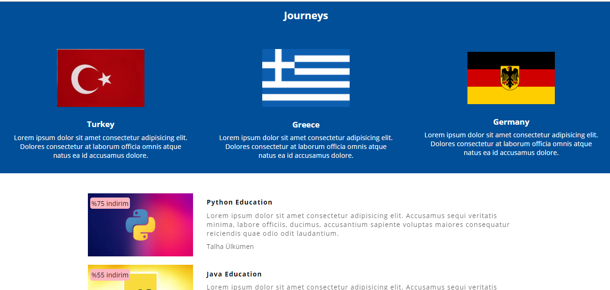
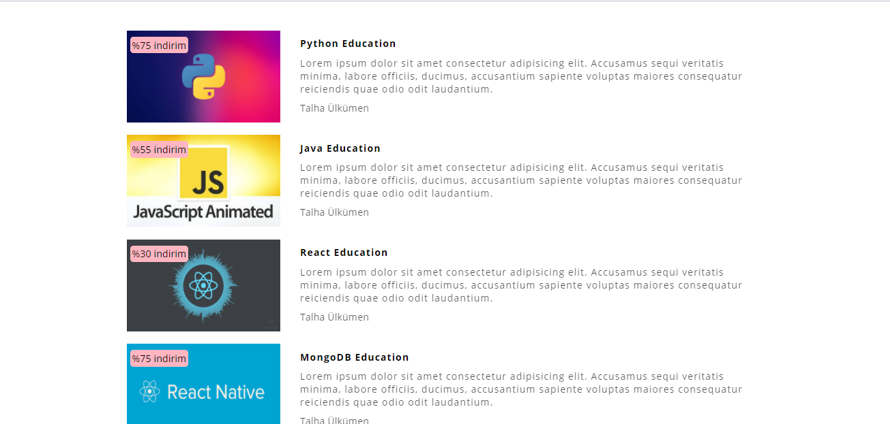
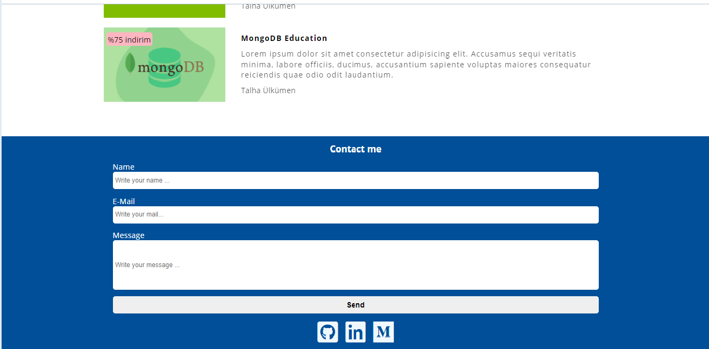

<h1 align="center">Personal-Website-Landing-Page---HTML-CSS-JS</h1>

## Description

It is a personal website home page work to repeat Html, Css and JavaScript topics.


## These are short promotional photos about this app


 
 


### At the end of the project, following topics are to be covered;

- HTML
- CSS
- JS


## How To Use


```bash

$ git clone https://github.com/Talha-35/Personal-Website-Landing-Page---HTML-CSS-JS.git

$ Open with Live Server
```


## Contact

- GitHub [@Talha](https://github.com/Talha-35)
- Linkedin [@Talha](https://www.linkedin.com/in/talhaulkumen/)

